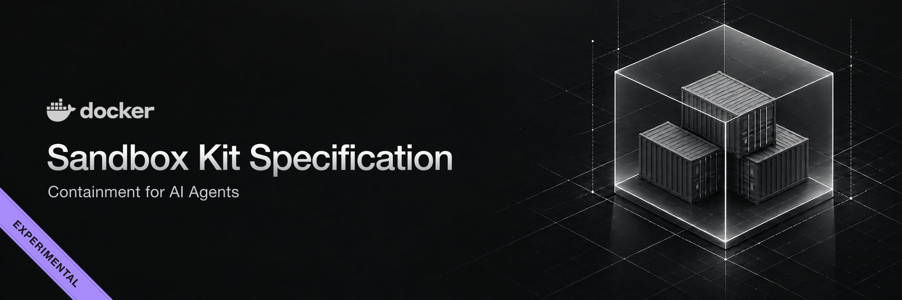

# Docker Sandbox Kit Specification v3

The kit v3 descriptor specification, its BuildKit frontend, and the
conformance suites that judge both a published kit and a runtime that
claims to support one.

> [!IMPORTANT]
> **This specification is experimental.** It is published to be used and
> argued with, and it will keep moving as implementers find gaps.
>
> Moving is meant to stay additive. Capability types carry their own
> version for exactly this reason: a contract that has to change ships as
> `@2` alongside the `@1` it joins, both stay published, and a descriptor
> names the one it was written against — so kits that resolve today are
> expected to keep resolving. A descriptor-wide `schemaVersion` bump is
> the last resort for what that lever cannot express.
>
> A final version is targeted for **Q4 2026**, after community feedback.
> That feedback is the point — if a kit you want to write cannot be
> expressed, or a runtime duty is stated in a way you cannot implement or
> check, please
> [open an issue](https://github.com/docker/sandbox-kit-spec/issues/new/choose).

## What a kit is

A kit packages a piece of a working environment — a tool, an agent, a
service — so that a runtime can install it, grant it what it needs, and
combine it with other kits without knowing anything about it in advance.

There is no kit media type, no artifact type, no sidecar file. A kit is one
OCI image where the manifest annotation
`vnd.docker.sandbox.kit.descriptor` carries the kit's **declarations** and
the layers carry its **content**.

Everything follows from that. A kit pulls with `docker pull`, gets
inspected with `regctl`, and can be `FROM`ed like any other image. A
registry that has never heard of kits stores one correctly, and an engine
that ignores the annotation still runs it as an ordinary image. The
declarations travel *with* the content, in the same artifact, under the
same digest: there is no second place to look and nothing to keep in sync.

### Two kinds

| Kind | Its layers are | Per composition |
|---|---|---|
| `workload` | A root filesystem. The image config supplies entrypoint, cmd, env, user, workdir. | Exactly one |
| `mixin` | An overlay that lands on the workload's filesystem. May carry no content at all and only declare. | Zero or more |

A workload is the thing that runs. Mixins add to it — a CLI, a credential
binding, a network rule, a piece of context for an agent.

## Tenets

A few principles decided most of the design. They are worth reading before
the details, because nearly every rule in the specification is one of these
applied to a specific case.

**Ride the ecosystem, don't extend it.** A kit introduces no new media type,
no artifact type, and no sidecar file, so every registry, scanner, signer,
and mirror already handles one correctly. The cost of a new artifact format
is not writing it — it is the decade of tooling that does not know about it.

**One artifact, one digest.** Declarations live in the manifest of the image
they describe, so a kit cannot be half-updated: pinning the digest pins the
policy, the content, and the metadata together. A separate file describing
an image is a second source of truth, and second sources drift.

**Declare only what images cannot already express.** The descriptor carries
no name, no image reference, no entrypoint or env. Identity is the reference
you consume the kit by; the runtime contract is the image config. Restating
either would create two answers to one question, and one of them would be
stale.

**One model for every ask.** Resource grants and engine-executed behaviors
are the same kind of request — a typed, versioned entry in `capabilities`.
A host reviews one list to decide what a kit may do, and a kit has one way
to ask, so support is a question with a single answer rather than a
patchwork of unrelated fields.

**Fail closed, and fail early.** Unknown descriptor fields are errors rather
than ignored, an unsatisfied requirement stops resolution, and a required
capability the host cannot grant refuses the launch. A permission silently
dropped is indistinguishable from one never requested, and the failure would
surface as behavior instead of an error.

**Composition is a function, not a sequence.** A resolved kit set is ordered
by its dependency graph rather than by the order arguments were typed, so
the same set always composes to the same image. That is what makes a
composition lockable, reproducible, and worth caching.

**The grammar declares; runtimes behave.** The descriptor states what is
wanted and never how a host provides it, which is why the capability pages —
not the grammar — are normative for runtime behavior. A host that cannot
implement a capability refuses it honestly instead of approximating it.

**Let types evolve on their own clock.** The `@1` in a capability type
versions that type's config schema, so a capability can change shape without
a descriptor grammar bump and hosts can support types the grammar has never
heard of.

For a worked tour — a real kit, its capabilities, and how a set composes —
see [docs/kit-intro.md](docs/kit-intro.md).

## Layout

- `docs/spec/SPEC-v3.md` — the normative specification: the descriptor
  grammar, the OCI layout, and one page per well-known capability type
  detailing the runtime behavior a supporting runtime implements.
- `spec/` — descriptor types, strict decoding, validation, arg expansion, and
  capability/version parsing. Import as
  `github.com/docker/sandbox-kit-spec/v3/spec`; this package is the single
  source of truth for the grammar, and the Docker Sandboxes runtime imports
  it to read published kits.
- `schema/kit.schema.json` — the descriptor grammar as a JSON Schema, for
  editor validation and completion. Point the yaml-language-server at it
  with a modeline on the descriptor's second line (the `# syntax=` line
  must stay first):

  ```yaml
  # syntax=docker/sandbox-kit:3
  # yaml-language-server: $schema=https://raw.githubusercontent.com/docker/sandbox-kit-spec/main/schema/kit.schema.json
  ```

  The Go validator remains the validator of record; `spec/schema_test.go`
  pins the schema's constants (need types, enums, field regexes) to the
  spec package so the two cannot drift silently.
- `schema/capabilities/` — one schema file per well-known capability type, named by the
  type (`com.docker.sandbox/volume@1.schema.json`): the `@version` in a
  need type names an addressable config schema, and these are those
  documents — each type owns its config shape, and `kit.schema.json`
  composes them by reference. Config-less types (`privileged@1`,
  `kit-registry@1`) reject every config value. A host-specific type's
  author publishes the equivalent under their own namespace.
- `cmd/frontend/` — the BuildKit gateway frontend dispatched by the
  descriptor's first line, `# syntax=docker/sandbox-kit:3`.

## How to get started

A guided tour from nothing to the local edit-and-run loop. Running kits
takes the `sbx` CLI (public install via
[Docker Docs](https://docs.docker.com/ai/sandboxes/install/) /
[sbx-releases](https://github.com/docker/sbx-releases)), plus a
registry namespace you can push to (Docker Hub works): the sandbox runtime
resolves kit *images* from registries, so an image that only exists in
Docker Desktop's local store cannot run. (Kit *directories* can — that is
the local loop in step 5, which needs no registry at all.)

**1. Install `sbx`.**

Kit v3 is not in the current stable line yet. Install a release candidate
(or nightly) from [sbx-releases](https://github.com/docker/sbx-releases):

```sh
# macOS
brew trust docker/tap
brew install docker/tap/sbx@rc

# Windows / Linux: download the matching RC artifacts from
# https://github.com/docker/sbx-releases/releases
# (stable WinGet / apt packages do not include kit v3 yet)
sbx login
```

There is nothing to install for the frontend itself:
[`docker/sandbox-kit:3`](https://hub.docker.com/r/docker/sandbox-kit) is
on Docker Hub, and BuildKit pulls it when it reads the `# syntax=` line.

Set your registry namespace once for the steps below, and log in:

```sh
export KIT_REGISTRY=docker.io/<your-hub-username>
docker login
```

**2. Push the hello kit and run it.** `hello` is the smallest workload
kit: a full agent environment with a startup hook, guidance, and a network
policy. `task kit:push` builds `examples/hello` with the kit frontend and
pushes it as an ordinary image:

```sh
task kit:push KIT=hello TAG=1.0.0 REGISTRY=$KIT_REGISTRY
sbx run $KIT_REGISTRY/sbx-kit-hello:1.0.0 .
```

Inside the sandbox, the kit is self-describing: `cat
/usr/share/sandbox/kit/hello/kit.yaml` shows the published descriptor,
`kit.dockerfile` the recipe that produced the content, and
`cat /var/log/sbx-kit-startup.log` shows the startup hook's run.
(`task kit:build KIT=hello` builds without pushing — useful for iterating
on a descriptor until it validates, but the result can't run in `sbx`
until it is pushed or consumed as a directory.)

**3. Add the tool kit — composition.** `tool` is a content-bearing mixin
that `requires` hello: the resolver validates the set is coherent, orders
provider before requirer, and the assembler merges the layers into one
image (cached by the lock — the second run reuses it).

```sh
task kit:push KIT=tool TAG=1.0.0 REGISTRY=$KIT_REGISTRY
sbx run $KIT_REGISTRY/sbx-kit-hello:1.0.0 --kit $KIT_REGISTRY/sbx-kit-tool:1.0.0 .
```

`cat /time.txt` inside the sandbox shows tool's startup hook ran on
hello's filesystem.

**4. Add the gh kit — binary content.** `gh` is a mixin whose overlay
carries the GitHub CLI as a pinned Nix closure, plus a phased network
policy and a proxy-managed credential. Composing it drops a real binary
into the workload's filesystem:

```sh
task kit:push KIT=gh TAG=2.72.0 REGISTRY=$KIT_REGISTRY
sbx run $KIT_REGISTRY/sbx-kit-hello:1.0.0 --kit $KIT_REGISTRY/sbx-kit-gh:2.72.0 .
```

Inside: `gh --version` works (`/usr/local/bin/gh` resolves into the
overlay's `/nix/store`), and with a `github` secret bound on the host
(`sbx secret set -g github`), `gh api user` authenticates through the
proxy — the container only ever sees a sentinel token.

**5. The local loop — no registry, no push.** Point `sbx run` at the kit
directories and the runtime builds them on demand, keyed by source hash,
and loads the results straight into the sandbox runtime:

```sh
cd examples
sbx run ./hello --kit ./gh .
```

Edit `hello/hello.yaml` (say, add an allow entry) and re-run: only hello
rebuilds; unchanged kits reuse the cache. `SBX_KIT_BUILDER=sandbox` moves
these builds into a dedicated builder sandbox (`sbx kit builder status`
shows it) instead of the host engine. When a kit is ready to share, step
2's `task kit:push` is the whole publishing story.

## Building a kit

```sh
docker buildx build . -f claude.yaml -t registry.example.com/claude-kit:2.1.0
```

A workload kit's companion must build on a base that provides the runtime's
platform floor — bash, the `agent` user (uid 1000), git, a CA store — which
the published `docker/sandbox-templates:*` images carry. A kit built on a
bare distro image builds fine but fails at agent launch.

A kit's content recipe lives in one of three places: a companion
`<stem>.dockerfile` next to the descriptor, an inline `build:` block in
the descriptor carrying literal Dockerfile text (see `examples/motd` for
the single-file form), or a `kits:` list naming other kits (see
`examples/team` — `kind: set`, below). They are mutually exclusive; a
`kind: mixin` kit with none of them is declaration-only.

The frontend finds the companion `claude.dockerfile` by naming convention,
builds it through `dockerfile.v0` (honoring the companion's own `# syntax=`
directive if it names a foreign frontend), validates the descriptor against
the resulting image, stages guidance content into the image, and attaches the
published descriptor as a manifest annotation. A `kind: mixin` descriptor
with no companion produces a declaration-only image whose single layer carries the published descriptor.

Build-phase args are passed by their kit-arg name and validated before the
Dockerfile sees them under the declared `buildArg` name:

```sh
docker buildx build . -f gh.yaml --build-arg version=2.99.0 -t gh-kit:2.99.0
```

## Publishing a set as one kit

A composition worth sharing does not have to stay a command line. A
`kind: set` descriptor names other kits in `kits:`, and the frontend
resolves them, checks the set is coherent, and merges their layers and
declarations into one ordinary kit:

```yaml
# syntax=docker/sandbox-kit:3
schemaVersion: "3"
kind: set
displayName: Team environment
version: "1.0.0"
kits:
  - ref: docker.io/me/sbx-kit-shell:1.0.0
  - ref: docker.io/me/sbx-kit-gh:2.72.0
```

```sh
# The registry the set is pushed to and the one it resolves its kits
# from are separate answers: the first names where this artifact goes,
# the second is baked into the references it merges.
task kit:push KIT=team TAG=1.0.0 REGISTRY=$KIT_REGISTRY \
  BUILD_ARGS="--build-arg registry=$KIT_REGISTRY"
sbx run $KIT_REGISTRY/sbx-kit-team:1.0.0 .
```

The result is a kit like any other — nothing in the runtime knows it was a
set — and `kind: set` never reaches consumers: publishing derives
`workload` or `mixin` from the kits it lists. The `kits:` list survives in
the published descriptor, pinned by digest, so the artifact records what it
was built from; inside the sandbox, `ls /usr/share/sandbox/kit/` enumerates
each of their staged sources. They must be published references: the set
has to be resolvable from its manifest alone, not from the directory it was
written in. See [§3.4](docs/spec/SPEC-v3.md#34-kit-set) for the
grammar and [§9.5](docs/spec/SPEC-v3.md#95-merging-a-set) for what the
merge does with each declaration.

Multi-platform builds produce an image index with the descriptor annotation
on every platform manifest:

```sh
docker buildx build . -f claude.yaml --platform linux/amd64,linux/arm64 --push \
  -t registry.example.com/claude-kit:2.1.0
```

## The frontend image

`# syntax=docker/sandbox-kit:3` resolves to
[`docker/sandbox-kit`](https://hub.docker.com/r/docker/sandbox-kit) on
Docker Hub, which BuildKit pulls and caches on the first build that names
it.

Every release also publishes its exact version — `docker/sandbox-kit:3.0.0-m.3`
— which is what a build names when it must resolve the same frontend
every time. The floating `3` moves only when a stable `3.X.Y` is
released, never for a milestone, so until v3 has one the two tags can
name different builds.

Building it yourself is for working on the frontend, not for using it. An
image under that tag in the local store is what a local build resolves,
without a registry pull, which is what makes an unreleased change
testable:

```sh
docker build -t docker/sandbox-kit:3 .
```

While iterating, `task frontend:dev` builds under a fresh tag and prints
the `# syntax=` line to paste, because BuildKit caches frontend
resolution per reference and a reused tag can keep dispatching the
previous binary. `task frontend:push` publishes, guarded.

## Conformance

Two suites judge conformance, and [`docs/spec/conformance.md`](docs/spec/conformance.md)
specifies what each one means. From this checkout, `task` runs the TCK via
`go run`. Released `kit-tck` binaries are attached to each
[GitHub Release](https://github.com/docker/sandbox-kit-spec/releases)
(linux/darwin/windows, amd64/arm64).

```sh
task tck:kit REF=docker.io/me/sbx-kit-gh:1.0.0   # is this artifact a conforming kit?
task tck:runtime ADAPTER=./my-adapter            # does this runtime behave as the pages require?
```

The kit checks also run inside the frontend during `docker buildx build`,
so a kit built here cannot be published malformed. Running them against a
published artifact catches what only the exporter and the registry can do
to it — and judges kits this frontend did not build.

A registry on loopback is reached over plain HTTP without asking, so a
throwaway `registry:2` works as a target while iterating; `kit-tck kit
--plain-http <ref>` says so explicitly for a TLS-less registry anywhere
else. An artifact that never reached a registry is judged in place from
the `--output type=oci` directory:

```sh
task tck:kit:layout DIR=/tmp/out TAG=sha256:...
```

A runtime is tested through an adapter: an executable implementing seven
verbs. Any language will do.

Both suites report the same way: every finding names the statement it
judged and links to where the specification says it, and the run ends in
a tally of what was checked. Nothing is printed for a check that passed —
`--verbose` lists those too — and `--format json` is the same run as data,
each finding carrying its spec link, for a pipeline that annotates rather
than reads. Color follows the terminal and `NO_COLOR`; `--color` settles
it either way.

```sh
kit-tck kit docker.io/me/sbx-kit-gh:1.0.0 --verbose
kit-tck kit docker.io/me/sbx-kit-gh:1.0.0 --format json
```

## Development

```sh
task validate   # gofmt + go vet
task test       # all Go tests
```

See [CONTRIBUTING.md](CONTRIBUTING.md) — in particular the note on changing
the grammar, which spans the Go types, the JSON Schema, the normative spec,
and the examples together.

## License

Licensed under the [Apache License, Version 2.0](LICENSE).
